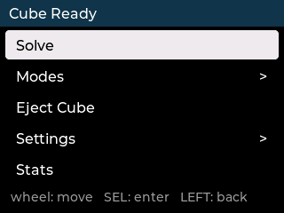

# CubeSolver desktop menu simulator

Runs the **real firmware** on a PC, with the ILI9341 panel and the seesaw wheel
replaced by SDL. Layout, fonts, text wrapping, navigation and LVGL memory
behaviour are all faithful, because they are produced by the same code that
ships — there is no second copy of the menu to drift out of step.



## Build and run

```sh
cmake -S Code/sim -B Code/sim/build
cmake --build Code/sim/build -j
./Code/sim/build/cubesim            # --scale 1..8, default 3
```

Needs `cmake`, a C++17 compiler, `libsdl2-dev`, and network access on the first
configure (LVGL is fetched, not vendored).

```sh
sudo apt install cmake build-essential libsdl2-dev
```

## Controls

**Machine controls** — these are the real machine's inputs:

| Key | Acts as |
|---|---|
| up / down arrow, mouse wheel | turning the wheel |
| `W` / `S` | the discrete UP / DOWN buttons |
| `Return`, `Space` | SELECT |
| left arrow, `Backspace` | LEFT (back) |
| right arrow | RIGHT (enters, same as the firmware) |
| `Return` + left arrow, held 1.5 s | abort the running operation |

**Simulator controls** — these do not exist on the machine:

| Key | Effect |
|---|---|
| `F` | arm a fault; the next operation fails |
| `C` | toggle whether a cube is loaded and scanned (flips the main menu) |
| `K` | toggle the calibration flags |
| `P` | screenshot to `sim-shot-NN.bmp` |
| `Esc`, close window | quit |

## What is real and what is not

**Real, compiled unmodified from `Code/libraries/CubeSolver`:** the sketch
itself (`CubeSolver.ino`), `CubeMenu`, `CubeDisplay`, `RotaryEncoder`,
`CubePump`, `CubeServo`, `CubeMotors`, `ColorSensor`, `MotorEncoder`,
`VirtualCube`, and the repo's own `lv_conf.h` — including its 32 KB
`LV_MEM_SIZE`, so LVGL pool pressure shows up here rather than on the bench.

**Real behaviour worth knowing about:**

- Start-up takes about ten seconds. Both servos sweep at 15 ms/degree through
  the real `CubeServo` code, exactly as the machine does. The first run is the
  slowest, because with no `sim-eeprom.bin` the servo state is unknown and
  `begin()` assumes worst-case travel.
- The abort chord is the firmware's own `pumpTick()`, copied rather than faked.
  Hold `Return` + left arrow during a scan and watch it unwind.
- `sim-eeprom.bin` persists calibration flags and servo positions between runs.
  Delete it to simulate a virgin board.

**Simulated:** `CubeSystemSim.cpp` replaces `CubeSystem.cpp` — the *only*
firmware file the simulator swaps out. Scan, solve, execute and calibration
report progress and consume a plausible amount of time (roughly a fifth of the
machine's, so menu work does not mean waiting out a 40-second scan), and can be
made to fail with `F`.

**Not simulated:** SPI refresh rate and tearing on the real panel, I2C timing
and bus contention, seesaw debounce, and actual cube solving — `kociemba` is
stubbed. The virtual cube's ready/not-ready state *is* real, which is what
drives the pre-scan vs post-scan main menu.

## Driving it from a script

Screenshots and regression walkthroughs work with `xdotool`, with two traps:

```sh
./Code/sim/build/cubesim --scale 2 &
sleep 14                        # let the servo sweeps finish

# Trap 1: SDL creates more than one X window. Take the LAST match.
WID=$(xdotool search --name "CubeSolver menu simulator" | tail -1)
xdotool windowfocus "$WID"      # XTEST needs focus; synthetic
                                # `xdotool key --window` events are ignored by SDL

# Trap 2: buttons are LEVEL-sampled every 25 ms by the firmware, so a press must
# be HELD. `xdotool key Return` is far too brief and is silently dropped.
hold() { xdotool keydown "$1"; sleep 0.12; xdotool keyup "$1"; sleep 0.45; }

hold Return                     # SELECT
xdotool key p                   # screenshot (the wheel/encoder path IS
                                # event-driven, so brief keys work for it)
```

## Going further (Tier 2)

Swapping `CubeSystemSim.cpp` for the real `CubeSystem.cpp` would give genuine
scan → solve → execute against a real virtual cube, enough to develop Scramble,
Idle, Demo and Patterns entirely on a PC. Two things stand in the way:

1. `homeMotors()` and `alignMotorsInternal()` poll the AS5600 encoders in a
   loop, so `MotorEncoder`/`AccelStepper` need to model a motor converging on
   its target rather than returning a constant.
2. The real kociemba solver has to be added to the build. It is portable C++ and
   compiles on a host unmodified — `shim/kociemba.h` deliberately keeps the same
   signature as `Code/libraries/kociemba/kociemba.h` so this is a build-list
   change, not a code change.
